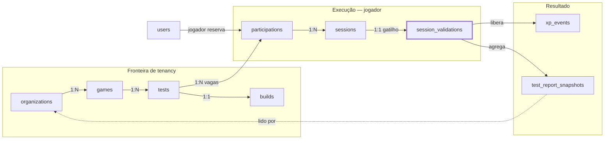
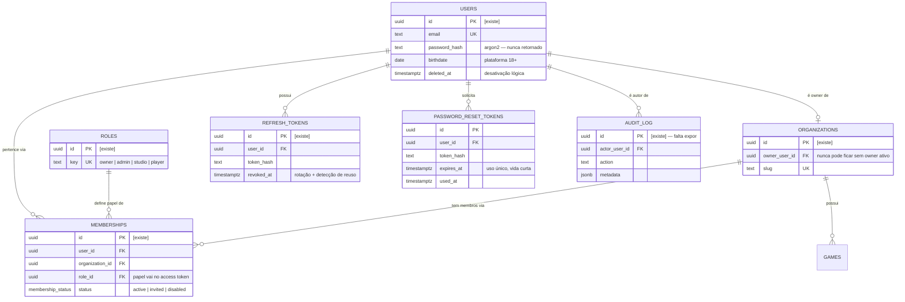
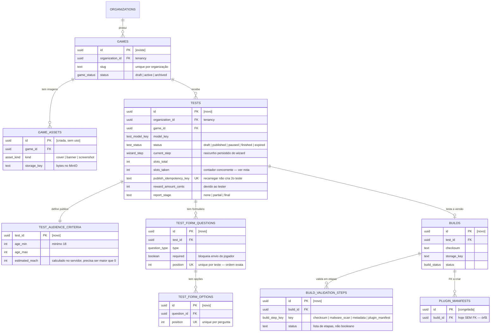
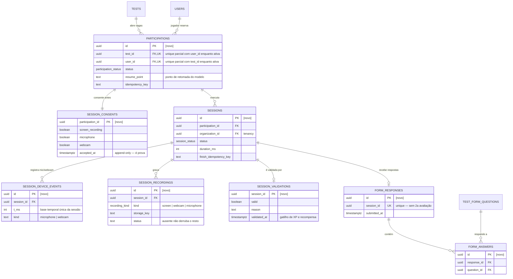
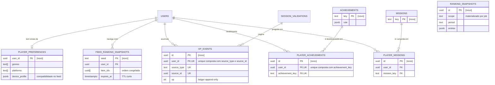
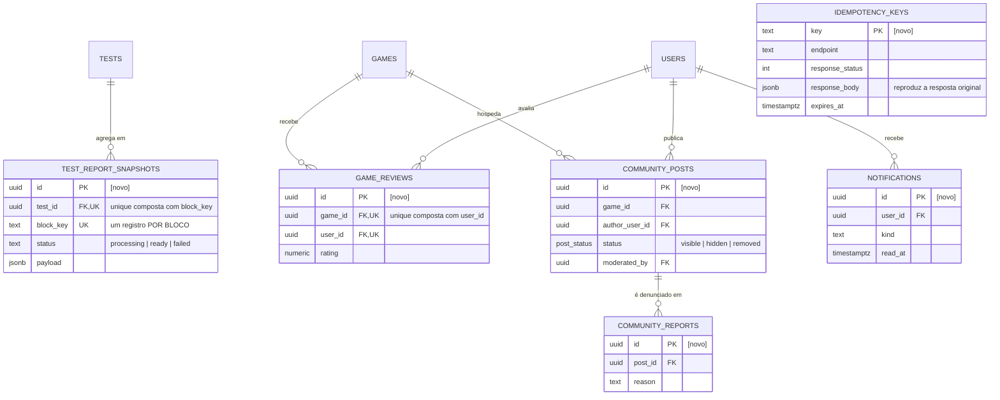
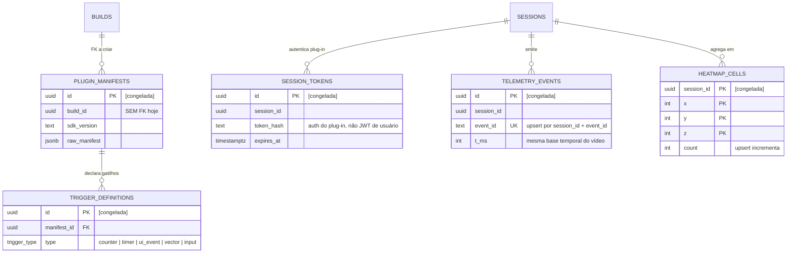

# OrbitPlay — DER

Diagrama entidade-relacionamento do banco, derivado de [`DATA-MODEL.md`](./DATA-MODEL.md).

Dividido em clusters porque um único diagrama com as ~41 tabelas não seria
legível. Cada cluster repete as entidades de fronteira (em geral `USERS`,
`ORGANIZATIONS`, `GAMES`, `TESTS`, `SESSIONS`) para que cada diagrama se
sustente sozinho.

**Legenda de situação**

| Marca no comentário | Significa                                                              |
| ------------------- | ---------------------------------------------------------------------- |
| `[existe]`          | tabela já criada e em uso                                              |
| `[criada, sem uso]` | tabela existe, nenhum código a consome                                 |
| `[novo]`            | a criar no escopo de plataforma                                        |
| `[congelada]`       | existe, dormente, contrato imutável (SDK e builds publicadas dependem) |

Tabelas deferidas (pagamento, carteira, boost, insights, transcrição) **não
aparecem** — ver `BACKEND-SPEC.md` §10.

---

## 1. Visão geral — a espinha do domínio

O caminho que liga o estúdio ao jogador. É o eixo que todo o resto pendura.

`session_validations` está destacada porque é o **gatilho**: nada de XP,
conquista ou recompensa acontece antes dela. É por isso que ela é uma tabela
própria, e não um campo booleano em `sessions` — a transição precisa ser um
insert único e transacional.

`organization_id` desce de `organizations` até `sessions` e é aplicado pelo
`BaseRepository`, nunca pelo serviço.

---

## 2. Auth e tenancy

`PASSWORD_RESET_TOKENS` alimenta `POST /auth/password/forgot` e
`POST /auth/password/reset`: o token de uso único (hash) fica aqui; ao
redefinir, `used_at` é setado e as sessões ativas do usuário são revogadas.

---

## 3. Jogo, teste e build

Dois pontos que o diagrama expõe:

- **`PLUGIN_MANIFESTS` está órfã.** `build_id` é um `uuid` sem FK porque
  `builds` não existia (`DECISIONS.md` §1.3). A migração que cria `builds` é o
  momento de fechar essa dívida, mesmo com o plug-in fora de escopo.
- **`BUILD_VALIDATION_STEPS` já inclui `plugin_manifest` no enum.** O passo
  entra depois sem migração de enum, e a UI consegue mostrar _onde_ a validação
  falhou em vez de só "falhou".

---

## 4. Participação e sessão

A unique parcial em `PARTICIPATIONS` — `(test_id, user_id)` enquanto o status
for ativo — é o que impede duas participações simultâneas no mesmo teste. Regra
de corrida não se resolve em código de serviço: dois pedidos simultâneos passam
pela checagem antes de qualquer um gravar.

Mesma lógica no unique de `FORM_RESPONSES.session_id`: é ele que garante que
reenviar o formulário não gera segunda avaliação.

---

## 5. Feed e gamificação

`FEED_RANKING_SNAPSHOTS` existe por um motivo específico: o cursor padrão da
API (UUIDv7) assume ordem cronológica estável, e um feed rankeado muda entre
requisições — paginar sem congelar a ordem produz item repetido e item pulado.
Como é efêmero, Redis é alternativa aceitável a uma tabela.

O XP total e o nível são **derivados** da soma de `XP_EVENTS`, nunca um contador
editável. A unique composta é o que faz "recarregar não duplica XP" valer no
banco, e não só no serviço.

---

## 6. Relatórios, comunidade e infra

`TEST_REPORT_SNAPSHOTS` guarda **um registro por bloco**, não um payload por
teste. É o que permite os blocos de telemetria e de IA entrarem depois como
blocos novos, e o que faz um bloco em erro não derrubar o relatório inteiro.

---

## 7. Congeladas — plug-in e telemetria

Existem no schema, dormentes. O contrato é **imutável**: o SDK e builds já
publicadas dependem desses formatos. Não mexer, mesmo com a telemetria fora de
escopo.

`TELEMETRY_EVENTS` é particionada por dia (`PARTITION BY RANGE (received_at)`),
o que o Drizzle não expressa — vive em `drizzle/manual/`.

---

## 8. Duas notas de implementação que o diagrama não mostra

**`tests.slots_taken` é um contador concorrente.** Vagas esgotando é exatamente
N jogadores pegando o último slot. Precisa ser
`UPDATE tests SET slots_taken = slots_taken + 1 WHERE id = ? AND slots_taken < slots_total`
numa transação, checando linhas afetadas — não `SELECT` seguido de `UPDATE`.

**Idempotência precisa de garantia no banco.** Guardar a chave só no Redis
resolve o caso feliz; duas requisições realmente simultâneas passam pelas duas
checagens antes de qualquer uma gravar. A proteção real são as unique
constraints marcadas nos diagramas — `tests.publish_idempotency_key`,
`form_responses.session_id`, `xp_events (user_id, source_type, source_id)` —
com o `23505` sendo capturado e convertido na resposta original.
